# Machina Labs Assignment 🔧✨
### Author: Kian Zohoury
### Los Angeles, CA
### kzohoury@utexas.edu
### 310-508-1617


## Setup
To get started, clone the repository:
```bash 
git clone https://github.com/kianzohoury/machina-labs-sol.git
```

Once the project is downloaded locally, we must set up the environment with the necessary dependencies. Please `cd` into `machina-labs-sol` and run the following using pip:
```bash
pip install -r requirements.txt
```

One of the required libraries in particular (NVIDIA's **kaolin**) relies on the exact versions of PyTorch and CUDA you have on your machine. If you do not have CUDA, you will not be able to run any model training, which is fine if you are just looking to read my code and possibly run inference. For this assignment, I primarily developed on Colab and used Lambda Cloud for distributed training, which had a later version of CUDA (12.4). The following had to be installed for my setup:
```bash
pip install torch==2.4.0 torchvision==0.19.0 torchaudio==2.4.0 --index-url https://download.pytorch.org/whl/cu124
pip install kaolin==0.16.0 -f https://nvidia-kaolin.s3.us-east-2.amazonaws.com/torch-2.4.0_cu124.html
```

## Problem Understanding
3D sensors like LiDAR are prone to generating noisy and incomplete point clouds, due to several factors like hardware/sensor limitations, human error, environment, etc. Thus, there is a strong need for deep neural networks to process and restore noisy/incomplete point clouds, to enable important downstream tasks, especially in the realm of manufacturing such as process monitoring and quality control. Without accurate data, the models (e.g. defect detection models) that drive these downstream tasks cannot make reliable predictions, and so the quality of manufactured parts cannot be reliably monitored or certified.

### Noisy Data
Point clouds affected by noise are problematic because the actual $(x, y, z)$ coordinate positions are unknown, and so the observed points derived from the 3D scanning process are not accurate. Even small amounts of noise can cause uncertainty for a downstream detection model, especially if the defects intended to be recognized are small. In computer vision, several methods have been introduced to denoise images (e.g. denoising autoencoders). In the context of geometric data, similar deep neural network architectures can be adapted to denoise point clouds, by essentially learning spatial/geometrics features associated with objects represented by entire point clouds, and "removing" noise by adjusting the coordinate positions of the corresponding/affected points.

### Incomplate Data
Even if noise can be reduced significantly, 3D scans may sometimes have only partial information. Again, due to several factors, a significant number of points can go missing, and retrieving those points may be impossible altogether. Therefore, we also need deep neural networks that can extrapolate the set of points that serve to "complete" the partial point cloud. Again, in computer vision, architectures like masked autoencoders attempt to fill in unknown/masked sections of images by relying on local features. Likewise, point completion models in the context of geometric data like point clouds can similarly rely on contextual information like surrounding points, to fill in sections of the object that are missing.

### Lack of Defect Data in Manufacturing
Additionally, when it comes to manufacturing, there is a need for high quality data used for training defect detection models. However, in situations where the quantity of data containing certain defects (e.g. tears, dents, cracks) is lacking, we need to simulate such defects. While it's possible to train detection models on limited data, we cannot be certain they are generalize well to unseen, real-world data. In order to create more robust detection models, we need to generate additional data in a controlled manner. Conditional generative models enable the creation of synthetic data given an input such as a text prompt. Diffusion models, in particular, are well-equiped to generate a variety of examples of certain defect types, if we can somehow prepare/collect an initial distribution of defective point clouds that we want to model. However, the main issue with synthetic data is achieving realism; that is, data that is plausible and helpful in training a downstream detection/classification model, by improving its performance and filling in parts of the distribution of training data that was previously not well represented.

## Dataset

The dataset I selected to train models for both tasks is **ShapeNetCore**, which is a subset of ShapeNet. It contains 16 popular classes of objects as point clouds. There are a few other datasets I could've used, but ultimately decided on ShapeNetCore due to pragmatism -- I was able to download it instantly from Kaggle, while the full ShapeNet and ModelNet40 required submitting email requests to download, and I needed to get to work quickly. However, I still believe the models I've trained on this dataset could easily be transferred to real-world data scanned from metal parts, as it has a reasonably diverse range of object geometries.


## Task I: Point Cloud Denoising & Completion

As outlined in the Problem Understanding section...

### **Dataset Preparation**

In order to load and work with the point cloud data as PyTorch tensors, I created the `ShapeNetCore` Dataset class, which was designed for loading examples from ShapeNetCore containing pairs of the form $(x, y)$, with $x$ being a noisy version of the original/clean point cloud $y$.

In order to accomplish this, I did the following:
* read `.json` metadata files containing the class labels and locations of their `.npy` files,
* loaded `.npy` files as numpy arrays, changed point clouds from `XZY` to `XYZ` format (this was more of a convenience for plotting), and converted the data to tensors
* applied several **pre-processing** and **data augmentation** steps for the denoising task, which I will describe next,
* and lastly converted all arrays into PyTorch tensors for training

#### **Pre-Processing**

Pre-processing is extremely crucial in most deep learning problems. Fortunately, since the point clouds from ShapeNet are already clean, the only pre-processing I had to do for them is **normalization** and **down-sampling**, due to the point clouds not being standardized when it comes to scale, nor in the density/number of points.

##### Normalization
The reason it's crucial for each point cloud to fit within the same scale is because at test time, if a model recieves data on a different scale, it may generalize very poorly, so it's something we need to always think about. More importantly, when adding perturbations like noise for the denoising task, it's imperative that the randomly generated noise is also on the same scale, otherwise you get very weird looking point clouds (which I encountered before normalization).

Below is a function that allows each point cloud to fit within the unit sphere (i.e. centered about the origin $\vec 0$ with a maximum vector norm $||x||_2 = 1$). For each point $x$, we normalize as follows:

1. compute the mean of the point cloud: $\mu_{x} = \frac{1}{n}\sum_i^n x_i$
2. compute the max norm of the point cloud: $x_{norm}$ = $\max_i ||x_i||_2$
3. compute the normalized point cloud
$\bar x = (x - \mu_x) / x_{norm}$

```python
def normalize_point_cloud(point_cloud: torch.Tensor) -> torch.Tensor:
    """Normalize point cloud to be centered at origin and have max vector norm of 1."""

    # find center (mean) of point cloud
    mu = torch.mean(point_cloud, axis=0)

    # find largest vector norm
    max_norm = torch.max(torch.linalg.norm(point_cloud, axis=1))

    # shift to be centered around origin and scale
    point_cloud_normalized = (point_cloud - mu) / max_norm
    return point_cloud_normalized
```

##### Down-sampling

Following data normalization, I down-sampled the point clouds to initially a maximum of 2048 points, but later found 1024 to be easier to work with (due to computational constraints). This was done by simply uniformily random sampling indices of the point cloud array to remove from the whole point cloud. Note, this is not the same as scaling (e.g. scaling the 3D object described by the point cloud to be larger or smaller). This is done in the `__getitem__` function of `NoisyShapeNetCore`:
```python
# downsample to max_points if necessary
if num_points > self.max_points:
    # use uniform random sampling (quick & dirty)
    if self.downsampling_mode == "uniform":
        num_remove = max(0, num_points - self.max_points)
        target_point_cloud = remove_points(
            point_cloud=target_point_cloud, num_remove=num_remove
        )
    # could be used for different down-sampling techniques (e.g. farthest point)
    else:
        pass
```

#### **Data Augmentation**

There is a series of data augmentation steps I took in order to curate the dataset for denoising/point completion. I will describe each function and then show how they are combined to generate noisy point clouds for training and evaluation on ShapeNetCore.

##### Adding Noise
The first agumentation is to randomly sample a noise vector from a normal distribution $\mathcal{N}(0, 1)$. The reasoning behind sampling noise from a Gaussian instead of a uniform distribution, is because it is *probably* (though I'm not certain on this) more realistic to how sensors receive noisy signals; however, other techniques of adding noise would likely also work pretty well and generate differently capable denoising models. The amount of noise that is added is controlled by a parameter $\epsilon$, which is the standard deviation of the Gaussian, but also specifically translates to a ratio of the norm (i.e. $\epsilon=0.01 = 1\%$ of the norm as a distance). Also, it's important to note that randomly sampling prevents the model from fitting to certain noise patterns, which is definitely not what we want our model to learn to solve. Increasing the strength of $\epsilon$ helps to also strengthen the model's denoising ability/robustness, but it should also be obvious that adding too much noise makes it very hard for a model to perform well, as the inputs start to become noise themselves, and may not even reflect the data seen in practice.

The process is as follows. For a given target point cloud $y$, we generate a noisy point cloud $x$:

$$x = y + v_{noise}$$

where $v_{noise} \sim \mathcal{N}(0, \epsilon)$. Note that all these vectors live in the same space (i.e. $\mathbb{R}^3$).

```python
def add_noise(
    point_cloud: torch.Tensor,
    noise_type: str = "uniform",
    amount: float = 1e-2
) -> torch.Tensor:
    """Randomly perturbs clean point cloud with specified type of noise."""
    if noise_type == "uniform":
        random_noise = amount * torch.randn(size=point_cloud.shape)
    elif noise_type == "gaussian":
        random_noise = torch.normal(mean=0, std=amount, size=point_cloud.shape)
    else:
        random_noise = torch.zeros_like(point_cloud)
    return point_cloud + random_noise
```

##### Removing Points
The second augmentation is to randomly remove points for the point completion task, similar to the down-sampling process described above, except we will do it in a more structured way. The ratio $r \in [0, 1)$ controls the number of points to remove from the point cloud, and so we can, for example, choose $r=0.25$, which will drop $25\%$ of the points, giving us an incomplete point cloud containing the remaining $75\%$ of the points. Initially, I had thought to remove the points in a uniform way to create a "sparse" point cloud, but decided to remove entire sections of the point cloud, which is how point completion tasks are typically formulated. For this, I randomly selected a point in the point cloud and removed an entire section via nearest neighbors.
```python
def remove_neighboring_points(point_cloud: torch.Tensor, num_remove: int):
    """Removes a local section of points by remove the nearest neighbors starting 
    from an initial point."""
    starting_idx = torch.randint(0, point_cloud.shape[0], size=(1, ))
    # get the initial point
    center_point = point_cloud[starting_idx]
    
    # calculate pairwise distances between this point and all other points
    distances = torch.cdist(center_point, point_cloud)
    
    # find indices to keep (corresponding to n - num_remove farthest neighbors)
    _, indices_to_keep = torch.topk(
        distances, max(0, point_cloud.shape[0] - num_remove), largest=True
    )
    
    # remove points via indexing
    reduced_point_cloud = point_cloud[indices_to_keep].squeeze(0)
    return reduced_point_cloud
```

##### On-The-Fly Data Augmentation
Similar to how models are trained in the literature, I used *on-the-fly* data augmentation for sampling noisy point clouds. Dynamically augmenting the point clouds ensures that the model never fits to certain noise patterns, which is a real possibility for large transformer-based models. It could be very easy to memorize how to denoise a given point cloud, if it always is present with the same noise pattern. So this type of data "sampling", if you will, ensures robustness and generalizability of the denoising model, since it will always see a slightly different noise pattern for each point cloud.

More specifcially, during a given training iteration, each point cloud $x_i$ will receieve a random transformation while the ground truth point cloud will remain clean. So for any given training epoch (one pass over the full batch of the training set), the noisy version of a point cloud is never identical. To accomplish this, I defined a `RandomTransform` class and had to ensure the seeds were set correctly for data loading, which I will describe in the training section.

Essentially, when called `RandomTransform` augments a point cloud, by first removing points according to the ratio $r$, and then adding noise according to $\epsilon$. However, the augmentations are done probabilistically, with a probability of applying both transformations as $\text{Pr}(\text{both})$. If only one augmentation is applied, the functions `remove_points()` and `add_noise()` have equal probability of being called.

In short, with $\text{Pr}(\text{both})=0.5$, roughly $50\%$ of the point clouds will receieve both augmentations, which means that $\text{Pr}(\text{add noise}) = \text{Pr}(\text{remove points}) = 0.25$. The `RandomTransform` class is very convenient, as it allows us to generate a specific kind of data distribution for each model we wish to train.

One additional thing to note is that once points are removed from a point cloud, you will point clouds of different sizes (i.e. number of points). The PyTorch `DataLoader` will have issues with this, since it expects each example in the batch to have the same shape. Moreover, similar to language tasks where sentences can be of different lengths, we need to zero-pad the point clouds. I defined a very simple function `add_padding()`, which appends zero vectors to the point cloud. On the surface, it may seem detrimental to the denoising task, but as I will describe shortly, we can bypass our denoising model from learning features associated with these redundant padding vectors via masking.

```python
def add_padding(point_cloud: torch.Tensor, max_points: int = 1024):
    """Adds zero-padding aka zero vectors according to the desired size."""
    num_pad = max_points - point_cloud.shape[0]
    padding = torch.zeros((num_pad, 3))
    padded_point_cloud = torch.cat([point_cloud, padding])
    return padded_point_cloud
```

##### Optional: Rotations

In theory, this should also help increase the denoising model's robustness to objects in different spatial orientations. Without going into exact details, I randomly sampled an angle $a \in [0, 2\pi]$ for rotation along $z$-axis. The rotated point cloud is achieved using the following matrix multiplication: 

$$x_{rot} = x\mathrm{M_{z}^{T}}$$

Note that we have to transpose the $3 \times 3$ rotation matrix because it assumes column vector orientation, but we're dealing with point clouds that contain row vectors.

```python
def rotate_z_axis(point_cloud: torch.Tensor) -> torch.Tensor:
    """Applies a random z-axis rotation to the point cloud."""
    # randomly sample angle
    angle = torch.tensor(
        2 * torch.pi * torch.rand(1).item(), dtype=torch.float32, device=point_cloud.device
    )
    
    # z-axis rotation
    rot_z = torch.tensor([
        [torch.cos(angle), -torch.sin(angle), 0],
        [torch.sin(angle), torch.cos(angle), 0],
        [0, 0, 1]
    ], device=point_cloud.device)

    # apply rotation matrix
    rotated_point_cloud = point_cloud.matmul(rot_z.T)
    return rotated_point_cloud
```

### Define Model Architecture

The architecture that I chose leverages transformers as they are highly adaptable beyond natural language tasks, including vision and geometric data such as the types of data (i.e. point clouds) we're dealing with. The idea behind using transformers is two-fold: (1) they are extremely powerful and easy to scale, as we can increase the depth of the model with a single line of code in PyTorch; (2) and more importantly, they utilize self-attention [], which is a highly important concept that allows for deep learning models to learn long-range dependencies and rich contextual information. Self-attention is defined as:

$$\text{Softmax}(\frac{\text{Q}\text{K}^{T}}{\sqrt{d_{k}}})\text{V}$$

where $\text{K} \in \mathbb{R}^{d_k \times d_{model}}$, $\text{Q} \in \mathbb{R}^{d_k \times d_{model}}$, $\text{V} \in \mathbb{R}^{d_v \times d_{model}}$ are learnable model parameters that generate the attention scores for each self-attention mechanism.

More specifically, I designed an encoder-decoder model that uses...


* explain why we can't use regular positional embeddings (non-discrete values)
* explain why causal mask is not required
* explain why purely encoder or decoder were not chosen
* explain how this is sort of like seq2seq, T5, etc. and why that allows us to generate more points as needed by the decoder with next token prediction

### Training Denoising/Point Completion Models
Now that the model architecture is outlined, we have to solve both tasks of (1) denoising point clouds and (2) completing point clouds with randomly missing points. While these can be thought of as distinct tasks, where one model could learn to denoise (e.g. denoising autoencoder) and another model solely for point completion, they could also in theory, be combined, which is initially what I did. In some sense, missing points is a form of "noise" as it results in a lossy data point that increases the uncertainty of a classification model designed to classify a point cloud. However, I found more success training separate models for each task.

Furthermore, before training, we need to determine an appropriate loss function that is not only well-suited for this task, but also differentiable. This is key, as it enables us to optimize our model using gradient descent, which requires differentiability to calculate gradients and run backpropagation.

#### **Loss Function**
We can unify both tasks with a single loss function, namely, **Chamfer Distance**. It is defined as:

$$L_{CD}(P_{1}, P_{2}) = \frac{1}{|P_{1}|}\sum_{p \in P_{1}} \min_{p' \in P_{2}} ||p - p'||_{2}^2 + \frac{1}{|P_{2}|}\sum_{p' \in P_{2}} \min_{p \in P_{1}} ||p' - p||_{2}^2$$

Note that I used the Euclidean distance formulation here (but $||\cdot||_{1}$ norm is sometimes used). Given two point clouds $P_1 \in \mathbb{R}^3$, $P_2 \in \mathbb{R}^3$, it essentially measures the distance between them. Specifically, for every point in $P_1$, it measures the distance between the nearest point in $P_2$, and vice versa. One thing to consider is that efficiently implementing this loss requires an efficient method of computing nearest neighbors (e.g. using K-D trees). In order to maximize efficiency (training speed), I've shamelessly decided to utilize NVIDIA's kaolin library, as their implementation uses special CUDA-related optimizations.

#### **Training Objective**
This is a supervised machine learning problem, where we have a training set $\mathcal{D}_{i}^{N} = \{(x_1, y_2),...,(x_N, y_N)\}$ with noisy input point clouds and their corresponding original ground truth point clouds. Our training objective is to find the optimal set of parameters $\theta$ of our model that minimizes the expected loss over the entire dataset, namely:

$$\theta^* = \arg\min_{\theta}\sum_{i}^{N}L(x_i, y_i, \theta)$$

where $$L(x_i, y_i, \theta) = L_{CD}(f_\theta(x_i), y_i)$$ and $f_\theta$ is our denoising model.

#### **Experimental Setup**
As mentioned in the data preparation section, I dynamically augmented the point clouds to ensure/mitigate the potential for the model to fit to certain noise patterns. I investigated two choices for both $\epsilon = 0.01, 0.02$ and $r=0, 0.5$:

| Model  | noise strength (%) | points removed (%) |
| :---------------- | :------: | :----: |
| PCDenoiser     |   1   | 0     |
| PCDenoiser     |   2   | 0   |
| PCCompletion     |  0    | 25     |
| PCCompletion    |  0    | 50   |
    
Initially, I had created a model architecture that could combine both tasks, but ultimately decided the split the tasks into two separate models.

##### **Hyperparameters**
The hyperparameters for training the denoising models were chosen empirically based on initial training runs and GPU capacity. Note that they are fixed across all four experiments, due to simplicity and the time constraint for this assignment. However, in practice one should optimize the hyperparameters separately for each of these four models as the distribution of the training data will be slightly to significantly different based on how different or extreme the data augmentations are for each combination.

* learning rate: $1e-3$
* warmup ratio: $0.1$
* batch size: $8$ x number of GPUs
* max number of epochs: $300$
* max number of points per point cloud: $1024$
* number of encoder/decoder layers: $8$
* number of self-attention/cross-attention heads per layer: $8$
* embedding & K, Q, V vector dimension: $256$
* number of dataloader processes/workers: $8$

#### **Optimization**
For optimization, I chose AdamW (with default parameters) as it's a powerful adaptive, momentum-based gradient descent optimization method that is typically very effective for training larger, transformer-based models. I also decided to use learning rate scheduling as it also (in my experience) improves training for transformer models. I used a linear schedule for the first 10% of training steps (10 epochs) to warmup the model and a cosine annealing schedule for the remanining 90% of training steps. I found that the warmups were essential for stable training in the initial stages, otherwise the models had trouble training/converging.

#### **Cross Validation**

##### Deterministic Augmentations
During training, data augmentations happens on-the-fly, but the augmentations for the validation set needed to be fixed in order to achieve consistency with cross validation. By defining a `worker_init_fn()`, I was able to deterministically control how augmentations were made to data batches. This is because `worker_init_fn()` is called when each worker is spawned (in parallel), and so the global random state (defined by the numpy seed) can fix the sampling behavior that control the augmentations when the data loader fetches a batch of data using different workers.

```python
def worker_init_fn(worker_id) -> None:
    """Custom initialization function that helps fix data augmentation behavior per worker."""
    seed = torch.initial_seed() % (2 ** 32)
    torch.manual_seed(seed + worker_id)
```

I also wanted to maintain consistency for each denoising experiment (i.e. training run) while allowing the data augmentations to be different for each epoch. To do this, I stored a master seed, and then generated `max_num_epochs` number of seeds, each being set during a new training epoch. The reason I felt this was important, is because I didn't want the variance in model performance to depend on the randomness of the data augmentations across training runs, as they would technically be seeing and training on slightly different distributions of data.

```python
torch.manual_seed(0)
if torch.cuda.is_available():
    torch.cuda.manual_seed(0)
        
# this allows each model to receive the same training augmentations
training_augmentation_seeds = torch.randint(2, 2**32 - 1, size=(MAX_NUM_EPOCHS, ))
```

##### Early Stopping

For a given experiment (training run), model selection was driven using **early stopping** based on a validation criteria (i.e. average loss). For each epoch, the denoising model is evaluated on a validation set using the same loss function during training. After 10 epochs, we terminate training if validation performance stagnates. This is one way that we can prevent **overfitting**, since we can simply stop training once the model stops improving. In my training code, it looks like this:

```python
if val_loss < best_val_loss:
    best_val_loss = val_loss
    # reset early stopping counter
    count = 0

    # save best model
    torch.save(...)
    print("Best model saved.")
else:
    # increment early stopping counter
    count += 1
    if count == patience:
        # stop training
        print("Stopping training early.")
        break
```

##### Baseline Comparison
One insightful validation/evaluation strategy is to also compare these models against a baseline (no model, just the Chamfer Distance between each $x$ and $y$ in the test dataset), to see if the models are actually better/worth using. We will use this to monitor model training but also evaluate their final performance.

The final model and checkpoint file that would be ultimately saved was the one tied to the highest validation performance (lowest total $L_{CD}$ loss), not the one resulting after all 100 epochs of training was completed.


##### **Visualizing Loss Curves**

It's always good practice to visualize your model performance during and after training. Usually, I will start with something like tensorboard because it is easy to integrate and track experiments, but I kept it simple for this assignment and just saved the per-epoch train and validation losses with `torch.save()`. Below, I've defined a plotting function that compares the said training and validation losses across all epochs and for each denoising model.  


## Task II: Generating Synthetic Defects with Diffusion Models

For this section, I relied on a pre-trained conditional text-to-3D diffusion model, specifically [point-e](https://github.com/openai/point-e) by OpenAI. Since training from scratch is obviously costly, I opted for fine-tuning point-e on point clouds derived from ShapeNetCore.

As mentioned in the problem understanding section, training a robust defect detection system relies on having a rich and diverse distribution of defects, with many examples per defect category, ideally across multiple types of part geometries. While in the context of metal forming/manufacturing, defects can manifest as wrinkling, cracks, warping, holes, etc., I constrained defects to simply mean point cloud "deformities," such as noise and missing points. Initially, I tried to simulate structural defects like bumps/dents, but found it quite tricky to implement without using meshes/normals corresponding to the point clouds. In theory, if we could model a certain defect as a series of functions/transformations applied to clean point clouds, we could easily fine-tune a diffusion model to generate these as well. The "realism" of the generated synthetic defective point clouds would be highly dependent on how well we can simulate defects (since training a generative model on unrealistic defects will give you just that) and how closely their characteristics match those found in real data.

For the fine-tuning task, I generated a distribution of training data, which consisted of input text prompts and defective point clouds (ground truth labels) sourced from point clouds from ShapeNetCore as before. Similar to the denoising/point completion tasks in Part I, I started with clean point clouds and applied defect transformations by either applying guassian noise or removing a connected section of points by sampling a random point and removing its neighbors. For the superivison signal (ground truth label) which the diffusion model is conditioned on, I generated simple text prompts by appending a given point clouds ShapeNet class label with a random defect type, in the following manner: `"<ShapeNet class> <defect type> defect"`. Below are examples from the resulting training set:

### Defect Examples
<p align="center">
  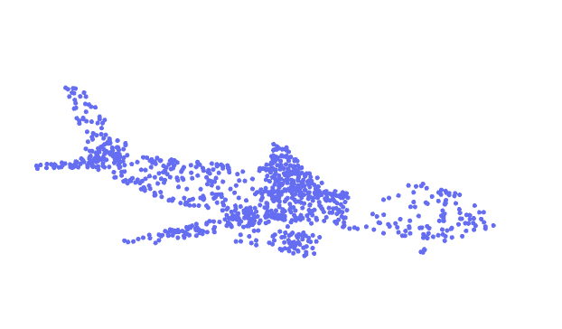
  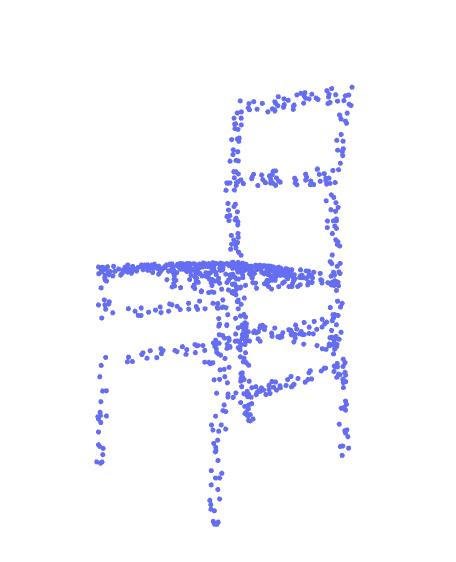
  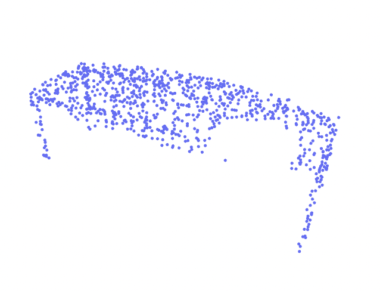
</p>

**text prompts**: *"airplane removal defect", "chair removal defect", "table removal defect"*

<p align="center">
  
  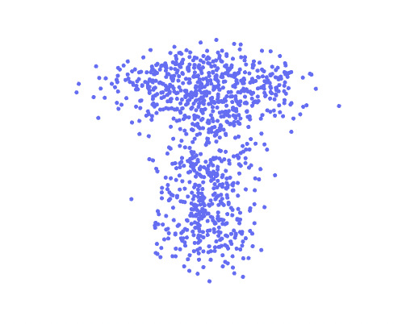
  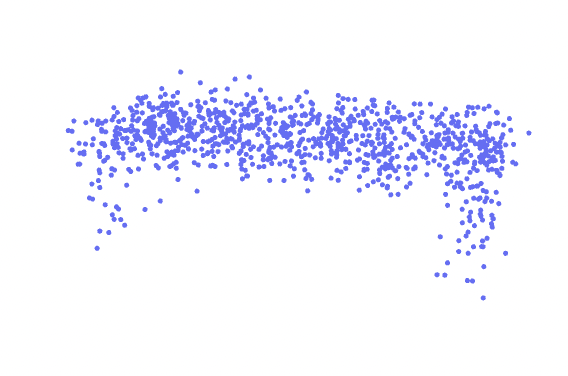
</p>

**text prompts**: *"cap noise defect", "lamp noise defect", "table noise defect"*

One thing to note is that point-e generates point clouds with additional color channels, since it was trained on Objaverse data. In order to use point clouds from ShapeNetCore as ground truth labels, I created dummy color channels for the last dimension, which holds $(x, y, z, r, g, b)$, where $r, g, b$ are the standard RGB color channels. 

### Run Fine-tuning
For fine-tuning point-e, I modified existing code from [this project](https://github.com/crockwell/Cap3D/tree/main). Mostly, I modified sections of code that allowed the model to be fine-tuned on data sourced from ShapeNetCore, with the transformations I wrote code for in Part I. Please note that the following commands may take some time to run, since several pre-trained models will have to be downloaded first. To run fine-tuning of the point-e diffusion model, change into the parent directory of the project (`cd ..`) and run the following from the main entry point of the package:
```bash
python -m machina-labs-sol.point-e.finetune_pointE --epoch 1 --defect_type removal --save_name removal_defect_diffusion
```
Here, we're specifying fine-tuning for only one epoch, but we can train for more epochs using the `--epoch` argument. You can also specify the defect type to fine-tune the model on, using the `--defect_type` argument. For simplicity, I kept the models separate, but I believe it would be ideal to fine-tune a single model to generate different defect types.

Model selection was carried out in the same fashion as Part I, where the best model was chosen based on its performance on a validation set.

### Optional: Download My Fine-tuned Models
To download the model checkpoints I trained previously, run the following commands:
```bash
huggingface-cli download kianzohoury/shapenet_diffusion  --local-dir ./checkpoints
```
which will save the checkpoints as `.pth` files in the `machina-labs-sol/checkpoints` directory.

### Generating Synthetic Defective Point Clouds
Running inference is also simple. Again, I had to make slight modifications to the original file, in order to handle the specific data I fine-tuned the diffusion model on. Once the model checkpoints are downloaded/created, we can generate synthetic defect data by running the following command:
```bash
python -m machina-labs-sol.point-e.text2ply_pointE --num_generate 5 --checkpoint ./machina-labs-sol/checkpoints/removal_defect_diffusion.pth
```
which will load the specified model checkpoint, e.g. `removal_defect_diffusion.pth`, generate the specified number of defective points cloud (5 in this case), and save them to the output directory `machina-labs-sol/synthetic_data`. Note that I unfortunately had to remove the upsample model, which increases the density/quality of the point clouds (by approximately a factor of 4), since I could not download the necessary model checkpoint. Having that additional model would likely increase the fidelity a bit and in turn, realism of the defective point clouds as well. 

### Visualizing/Assessing Realism of Synthetic Data
Let's take a look at a few examples of synthetic defective point clouds generated from the fine-tuned diffusion models below:

#### Synthetic "Removal/Incomplete" Defects
<p align="center">
  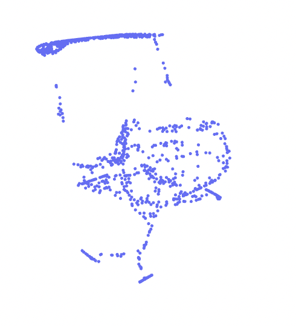
  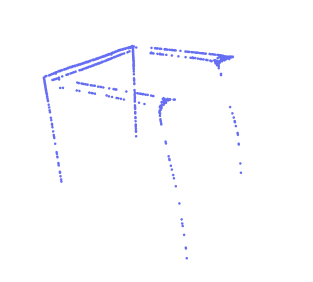
  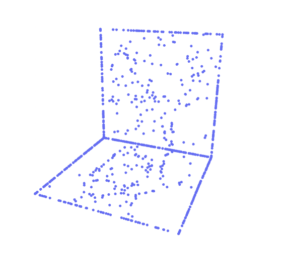
</p>

We see that the first two point clouds for the chair and table are quite deformed, missing structural pieces, while the third point cloud of a laptop has more structural integrity, but is missing clusters of points on both of its flat surfaces. I believe additional fine-tuning is required to generate more realistic samples, but I did not run enough inference to conclusively say this model generates completely unrealistic incomplete point clouds. 

#### Synthetic "Noise" Defects
<p align="center">
  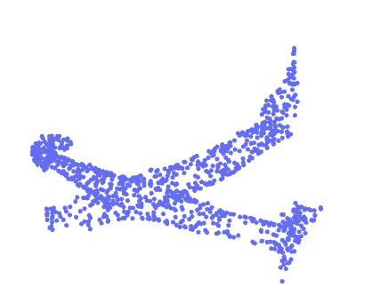
  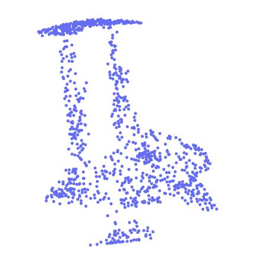
  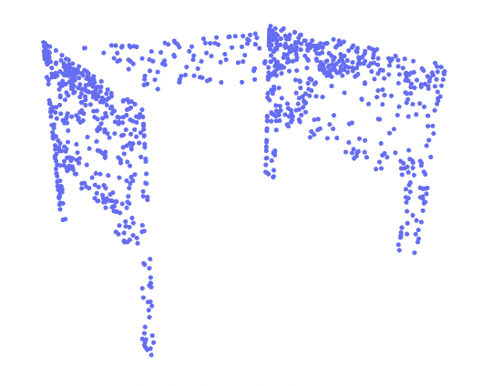
</p>
Compared to the synthetic data with removal defects, the synthetic noisy samples are more coherent, interestingly enough. They are not as noisy as the original distribution the diffusion model was fine-tuned on, which again, is surprising, but perhaps not if you consider the "denoising" nature of diffusion models. Perhaps it's harder/takes longer to fine-tune the model to understand that noise is desired, in this case, and not noise that is removed from latent representations during the backward phase. Nevertheless, these examples are geometrically consistent but noisy enough to be somewhat realistic and possibly representative of real-world laser-scanned 3D data.

### Impact of Synthetic Data on Downstream Detection Models
While I did not make it to this section, I would have certainly tried to optimize the diffusion model more, in order to generate higher quality synethic, defective points clouds, and evaluated the effects they had on downstream classification/detection models. I would have likely started with [PointNet](https://github.com/charlesq34/pointnet), which could've led to some interesting insights about the quality of the synthetic data. 
For example, if the PointNet classifier failed to identify the correct classes corresponding to the synthetic data, I would try to understand why/how the classifier was struggling. Because the classifier is not explicitly trained on defective data, it is expected that it will be exhibit higher uncertainty with defective point clouds, which are technically out-of-distribution. However, high uncertainty could mean that the defects are too extreme/unrealistic for the classifier to recognize the object's class. So, in some sense, if the defects are truly realistic, they would easily "fool" or pass as genuine instances of certain classes, according to the classifier. Instead of a classifier, we could also use a typical anomaly detection model (e.g. an autoencoder). If the synthetic defective point clouds have a reconstruction error below the acceptable threshold, then in some sense, they are of the same distribution as the original/nominal point clouds.
