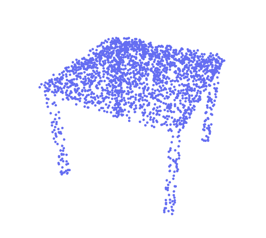
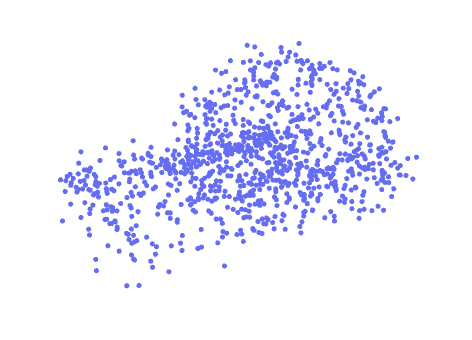

# Machina Labs Assignment 🔧✨
### Author: Kian Zohoury
### Los Angeles, CA
### kzohoury@utexas.edu
### 310-508-1617


<!-- <p align="center">
  
</p> -->

<p align="center">
  
  
  
</p>

<p align="center">
  <i>Predicted point clouds (top) given unseen (test set) incomplete or noisy point clouds (bottom), achieved by training point cloud denoising and completion models. </i>
</p>

## Table of Contents
- [Setup](#setup)
- [Problem Understanding](#problem-understanding)
  <!-- - [Problem 1. Noisy Data](#problem-1-noisy-data)
  - [Problem 2: Incomplete Data](#problem-2-incomplete-data)
  - [Problem 3: Lack of Defect Data in Manufacturing](#problem-3-lack-of-defect-data-in-manufacturing) -->
- [Dataset](#dataset)
- [Part I: Point Cloud Denoising & Completion](#part-i-point-cloud-denoising--completion)
  - [Dataset Preparation](#dataset-preparation)
  - [Pre-Processing](#pre-processing)
    <!-- - [Normalization](#normalization)
    - [Down-sampling](#down-sampling)
    - [Zero Padding (fake up-sampling)](#zero-padding-fake-up-sampling) -->
  - [Data Augmentation](#data-augmentation)
    <!-- - [Denoising Task: Adding Noise](#denoising-task-adding-noise)
    - [Point Completion Task: Removing Points](#point-completion-task-removing-points)
    - [Optional: Rotations](#optional-rotations)
    - [On-The-Fly Data Augmentation](#on-the-fly-data-augmentation) -->
  - [Define Model Architecture](#define-model-architecture)
    <!-- - [CompletionTransformer](#completiontransformer)
    - [DenoiserTransformer](#denoisertransformer) -->
  - [Training](#training)
    <!-- - [Loss Function](#loss-function)
    - [Training Objective](#training-objective)
    - [Experimental Setup](#experimental-setup)
    - [Hyperparameters](#hyperparameters)
    - [Optimization](#optimization)
    - [Cross Validation & Early Stopping](#cross-validation--early-stopping)
    - [Random Seeds & Deterministic Augmentations](#random-seeds--deterministic-augmentations)
    - [Baseline Comparison](#baseline-comparison)
    - [Run Training](#run-training) -->
  - [Download My Trained Models](#download-my-trained-models)
  - [Loss Curves](#loss-curves)
  - [Test Performance](#test-performance)
  - [Visualizing Denoised & Completed Point Clouds](#visualizing-denoised--completed-point-clouds)
- [Part II: Generating Synthetic Defects with Diffusion Models](#task-ii-generating-synthetic-defects-with-diffusion-models)
  - [Defect Examples](#defect-examples)
  - [Run Fine-tuning](#run-fine-tuning)
  - [Download My Fine-tuned Models](#download-my-fine-tuned-models)
  - [Generating Synthetic Defective Point Clouds](#generating-synthetic-defective-point-clouds)
  - [Visualizing/Assessing Realism of Synthetic Data](#visualizingassessing-realism-of-synthetic-data)
    <!-- - [Synthetic "Removal/Incomplete" Defects](#synthetic-removalincomplete-defects)
    - [Synthetic "Noise" Defects](#synthetic-noise-defects) -->
  - [Impact of Synthetic Data on Downstream Detection Models](#impact-of-synthetic-data-on-downstream-detection-models)


## Setup
To get started, clone the repository:
```bash 
git clone https://github.com/kianzohoury/machina-labs-sol.git
```

Once the project is downloaded locally, we must set up the environment with the necessary dependencies. Please `cd` into `machina-labs-sol` and run the following using pip:
```bash
pip install -r requirements.txt
```

One of the required libraries in particular (NVIDIA's **kaolin**) relies on the exact versions of PyTorch and CUDA you have on your machine. If you do not have CUDA, you will not be able to run any model training, which is fine if you are just looking to read my code and possibly run inference. For this assignment, I primarily developed on Colab and used Lambda Cloud for distributed training, which had a later version of CUDA (12.4). The following had to be installed for my setup:
```bash
pip install torch==2.4.0 torchvision==0.19.0 torchaudio==2.4.0 --index-url https://download.pytorch.org/whl/cu124
pip install kaolin==0.17.0 -f https://nvidia-kaolin.s3.us-east-2.amazonaws.com/torch-2.4.0_cu124.html
```

## Problem Understanding
3D sensors like LiDAR are prone to generating noisy, incomplete point clouds, due to several factors like hardware/sensor limitations, human error, environment, etc. Thus, there is a strong need for deep neural networks, especially in the realm of manufacturing, to efficiently process and accurately restore noisy/incomplete point clouds. Achieving such models is crucial, as they unlock the potential for fully automated process monitoring and quality control. Without accurate point cloud data, downstream systems like defect detection models cannot make reliable predictions, and so the quality of manufactured parts cannot be trusted and certified.

### Problem 1. Noisy Data
Point clouds affected by noise are problematic because the true $(x, y, z) \in \mathbb{R}^3$ coordinate positions are unknown, which means the observed points derived from the 3D scanning process are not fully accurate. Even small amounts of noise can contribute to model uncertainty for downstream detection/classification systems, especially if the defects to be identified are small. In computer vision, several methods have been introduced to denoise images (e.g. denoising autoencoders). In the context of geometric data, similar deep neural network architectures have been adapted to denoise point clouds. By learning latent spatial/geometric features associated with 3D objects, denoising models can learn to reduce residual noise and produce cleaner sets of points, resulting in smoother object surfaces with more identifiable shapes.

<p align="center">
  
</p>
<p align="center">
  <i>Point cloud of an airplane becomes less identifiable as the noise level gradually increases.</i>
</p>

### Problem 2: Incomplete Data
Even if noise can be significantly reduced, it is common for 3D scans to only contain partial information of the object. Again, due to different factors (e.g. sensor malfunctions and occlusions), a sizeable portion of points can go missing, and retrieving these points may be time-consuming, costly, or outright impossible. Therefore, we also need deep neural networks that can extrapolate from a partial set of points and "complete" the full picture. In computer vision, architectures like masked autoencoders attempt to fill in masked sections of images by relying on local features extracted via convolutional filters. Similarly, point completion models operate on point sets, which inherently contain neighborhoods/regions of points that provide salient contextual information necessary to accurately fill in missing pieces of an object. However, a key challenge in point completion is capturing sufficient relevant context, both locally *and* globally, to help the model to understand which features to focus on when generating new points.

<p align="center">
  
</p>
<p align="center">
  <i>Point cloud of an airplane still identifiable but missing crucial spatial/geometric data as number of missing points increases.</i>
</p>

### Problem 3: Lack of Defect Data in Manufacturing
Additionally, the quantity of point cloud data representing metal manufacturing defects (e.g. tears, dents, wrinkles, cracks, etc.) is small, presumably due to a lack of high-quality, human annotations. Unsupervised anomaly detection approaches have been designed for this exact reason; however, more precise defect detection models that rely on semantic segmentation typically require ground truth labels (i.e. nominal vs. defects) as they are trained in a supervised fashion. While it's possible to train detection models on the limited data that currently excists, we cannot be certain these models will generalize well to unseen, real-world data. 

In order to create robust defect detection models, we need to generate large quantities of high-quality synthetic data in a controlled manner. Conditional generative models can do exactly this, as the generative process can be conditioned on inputs such text prompts. More specifically, conditional text-to-3D diffusion models are well-equipped to generate a variety of examples of a specific class (e.g. defect type), if we can somehow prepare/collect an initial distribution of data (in this case, defective point clouds) that we wish to simulate. However, the difficulty with using synthetic for training downstream detection/classification models is achieving realism: that is, data that is plausible and could belong to the true distribution. Training a diffusion model capable of generating "real" defects would likely improve detection performance significantly, as it would fill in gaps in the data distribution that are currently poorly represented.

## Dataset

The dataset I chose for solving the three outlined problems is called **ShapeNetCore**, which is a subset of ShapeNet. It contains 16 popular classes of objects as point clouds. There are a few other datasets I could've used, but ultimately decided on ShapeNetCore due to pragmatism -- I was able to download it instantly from Kaggle, while the full ShapeNet/ShapeNetCore and ModelNet40 required submitting email requests to download, and I needed to get to work quickly. However, I still believe the models I've trained on this dataset could easily be transferred to real-world data scanned from metal parts, as it has a reasonably diverse range of object geometries.

<p align="center">
  
  
</p>

<p align="center">
  <i>Class distribution and example point cloud of a table with 2048 points.</i>
</p>

One limitation with the version of ShapeNetCore I downloaded from Kaggle is that the point clouds are fairly sparse (vs. dense point clouds with >= 10k points), presumably because they were already down-sampled. Larger point clouds equate to more computational load, but also better models, so the models I designed would likely be improved with richer point cloud sets.

## Part I: Point Cloud Denoising & Completion

As outlined in the problem understanding section, the two primary tasks are point cloud denoising and completion, which will be the focus of Part I. For these tasks, I used the same underlying source data and applied data augmentations/corruptions in order to generate input examples for each specific task. 

### **Dataset Preparation**

In order to load and work with the point cloud data as PyTorch tensors, I created the `dataset.ShapeNetCore` Dataset class, which was designed for creating labeled examples *on-the-fly* from ShapeNetCore, where each example pair  $(x, y)$ consists of a noisy or incomplete version $x$ of the original, clean point cloud $y$.

In order to accomplish this, I did the following:
* read `.json` metadata files containing the class labels and locations of their `.npy` files,
* loaded `.npy` files as numpy arrays, changed point clouds from `XZY` to `XYZ` format (this was more of a convenience for plotting), and converted the data to tensors
* applied several **pre-processing** and **data augmentation** steps for the denoising/completions tasks, which I will describe next

### **Pre-Processing**

Pre-processing is extremely crucial in most deep learning problems, especially for computer vision. Fortunately, since the point clouds from ShapeNetCore are already clean (aka noise-free), the only pre-processing I had to do was **normalization** and **down/up-sampling**, due to the point clouds not being standardized when it comes to scale, nor in the density/number of points.

#### Normalization
The reason it's crucial for each point cloud to fit within the same scale is because at test time, if a model recieves an input that is on a significantly different scale, it may generalize poorly. More importantly, when adding perturbations like noise for the denoising task, it's imperative that the randomly generated noise also matches the scale, otherwise the point clouds may get distorted/stretched along a certain dimension, which I encountered before applying input normalization. The `dataset.transform.normalize_point()` function normalizes a point cloud to fit within the unit sphere (i.e. centered about the origin $\vec 0$ with a maximum vector norm $||x||_2 = 1$), by doing the following:
1. compute the mean of the point cloud: $\mu_{x} = \frac{1}{n}\sum_i^n x_i$
2. compute the max norm of the point cloud: $x_{norm}$ = $\max_i ||x_i||_2$
3. compute the normalized point cloud
$\bar x = (x - \mu_x) / x_{norm}$

#### Down-sampling

Following data normalization, I down-sampled point clouds to have exactly 1024 points (initially, I set the maximum to 2048 points, but found 1024 to be good enough). This was done by uniform random sampling of point cloud indices to remove, using the `dataset.transform.remove_points()` function. However, other types of down-sampling like farthest point sampling would also work well. Note, this is not the same as scaling (e.g. scaling the 3D object described by the point cloud to be larger or smaller).

#### Zero Padding (fake up-sampling)
For point clouds with fewer than the desired number of points (i.e. 1024), I applied zero-padding with the `dataset.transform.add_padding()` function, similar to how language modeling tasks require padding tokens for sentences of variable lengths. Furthermore, the PyTorch `DataLoader` expects tensors in a batch to have the exact same shape, so this was a necessary step. There are definitely other ways to up-sample point clouds, but I didn't want to potentially add noise to already clean ground truth point clouds.

### **Data Augmentation**

#### Denoising Task: Adding Noise
To generate a noisy input $x$, I created the function `dataset.transform.add_noise()`, which randomly samples a noise vector $v_{noise} \sim \mathcal{N}(0, \epsilon)$ from a gaussian (or uniform distribution $U[-\epsilon, \epsilon]$, if specified), and perturbs the original point cloud $x = y + v_{noise}$. The amount of noise that is added is controlled by a parameter $\epsilon$. Increasing the value of $\epsilon$ makes it more challenging for the denoising model to recover the original signal. Of course, if the value is too high, the inputs will start to resemble noise more than the objects themselves, which may not even reflect the noise levels found in typical 3D scans. Nevertheless, it's worthwhile to push the model's denoising abilities by testing higher noise amounts.

#### Point Completion Task: Removing Points
To create an incomplete point cloud $x$, I created the function `dataset.transform.remove_neighboring_points()`, which given a ratio of points to remove $r \in [0, 1)$, starts with a random point in the set and removes it along with its $\lfloor |x| * r \rfloor$ nearest neighbors. For example, if we choose $r=0.5$, we will have training inputs of size $|x| = 512$ and ground truth labels of size $|y| = 1024$. Note that for the denoising task, however, it's always true that $|x| = |y|$ since no points are ever added or removed.

#### Optional: Rotations
Although not strictly necessary, I randomly applied $z$-axis rotations to point clouds in order for the models to see objects in different spatial orientations. The function `dataset.transform.rotate_z_axis()` selects a random angle $a \in [0, 2\pi]$ and applies a $3 \times 3$ rotation matrix $\mathrm{M_z}$, such that $x_{rot} = x\mathrm{M_{z}^{T}}$. Note that because the point cloud tensors are technically composed of row vectors, I had to transpose the rotation matrix before multiplication, since it assumes column vector orientation.

#### On-The-Fly Data Augmentation
Similar to how models are trained in the literature, I used *on-the-fly* data augmentation for sampling noisy/incomplete point clouds. Dynamically augmenting the point clouds ensures that the model never fits to certain noise patterns, which is a real possibility for larger transformer-based models. It's entirely plausible that an over-parameterized model may memorize how to denoise particular point clouds if they always present the same noise patterns. During a given training epoch, each point cloud $x$ will receive a slightly different transformation, which is achieved with the `dataset.transform.RandomTransform` class and random seeding, which I will describe during the training setup.


### Define Model Architecture
The models I designed for both tasks share the same general encoder-decoder, transformer-based architecture. Compared to sequence-to-sequence translation models that typically use an encoder-decoder transformer structure, the models I designed are instead functionally similar to vanilla CNN autoencoders. Instead of treating input/output data as sequences and iteratively generating tokens (points) in an auto-regressive fashion (aka next token prediction), I formulated the problem as a set-to-set translation problem (with a fixed output length) with the goal of reconstructing/generating new sets of point given their input sets. Furthermore, instead of wanting to maximize the likelihood of a sequence of token predictions, we want to minimize the reconstruction error for some predicted output (i.e. a point set), which is more in line with autoencoders.

Since point clouds are unordered by nature, it made sense to use transformers, as they are permutation-equivariant (underlying computations of features are independent of their absolute orderings) without the use of standard positional encodings. Not only are transformers extremely powerful and easy to scale, but also highly-suited for learning complex relationships and long-range, global dependencies between points in a set, via the self-attention mechanism:

$$Attention(\text{Q}, \text{K}, \text{V}) = \text{Softmax}(\frac{\text{Q}\text{K}^{T}}{\sqrt{d_{k}}})\text{V}$$

where $\text{Q}$, $\text{K}$, and $\text{V}$ are called query, key, and value vectors, which are computed via matrix multiplication with learnable model parameters, i.e. $\text{Q} = QW^Q$, $\text{K} = KW^K$, and $\text{V} = VW^V$, where $\text{K} \in \mathbb{R}^{d_k \times d_{model}}$, $\text{Q} \in \mathbb{R}^{d_k \times d_{model}}$, $\text{V} \in \mathbb{R}^{d_v \times d_{model}}$. Note that in our case, we will keep things simple and choose $d_{model} = d_k = d_v$. The underlying computation of the attention output for transformers allows each point to "attend" to all other points in a point set, and in this way, capture spatial/geometric relationships without explicitly computing things like relative distances or nearest neighbors (although encoding schemes that incorporate these can help boost performance as well).

For both tasks, the general idea was to utilize the encoder for feature extraction and decoder for reconstruction. The specific architecture I implemented for point cloud completion is inspired by [PoinTr](https://github.com/yuxumin/PoinTr), while the denoising model is a simpler, more general encoder-decoder transformer model.

#### CompletionTransformer
The architecture for the point completion model `models.completion.CompletionTransformer` consists of an encoder, decoder, and query generator. The encoder extracts spatial/geometric features and those features are aggregated/summarized into a global feature map that informs the query generation process. More specifically, I implemented `models.transformer.QueryGenerator` as follows:

##### Query Generation
1. concatenate all intermediate encoder features along the last (embedding) dimension
2. project these combined features to a new "global" feature space
3. apply max/mean pooling to extract a "summary" of the global features
4. generate "rough" coordinate features given the summarized features
5. aggregate summary features from step 3 with the rough coordinate features via concatenation
6. generate `num_query` query embeddings by projecting aggregated features back to the embedding space

The goal of the query generator module, is to generate an initial set of point embeddings given local/global features extracted by the encoder. Query embeddings are then passed through the decoder layers, along with the encoder features as the keys/values, and processed together via cross-attention. The idea here is to guide the decoder in translating these initial query embeddings into the correct points that complete the point cloud, by attending to the salient contextual features extracted by the encoder at each corresponding layer.

<p align="center">
  
</p>

Note that the diagram is simplified, but each self-attention/cross-attention module follows the standard transformer recipe with multiple heads, residual layers, layer normalization, and feed-forward layers.

#### DenoiserTransformer
The architecture for the denoising model `models.denoiser.DenoiserTransformer` is similar, minus the additional module for generating new points. For this reason, I contemplated using just an encoder, but found it was better to incorporate a decoder, as it splits up the computation for the encoder. That is the encoder solely focuses on extracting rich contextual features, while the decoder focuses on reconstructing the set of points, given the learned features from the encoder. Again, the decoder uses the latent features from the encoder as keys/values, attending to the features that help the decoder refine and reconstruct the correct points.

<p align="center">
  
</p>

As previously mentioned, because point clouds are unordered sets, I did not use positional embeddings, as point clouds inherently contain positional information. However, some methods use geometric embeddings, utilizing k nearest neighbors (k-NN) to extract local information for each point. In hindsight, if I had more time, I would've explored using similar techniques, or perhaps pre-trained models to extract embeddings; however, for the purposes of this assignment, I implemented learned embedding layers (input/output projections), which mapped point clouds $\in \mathbb{R}^3$ to point embeddings $\in \mathbb{R}^{d_{model}}$ and vice versa.

### Training
The following section outlines the training and experimental setups. 
#### Loss Function
For both denoising and point completion tasks, I chose the **Chamfer Distance** as the loss function, since point clouds are unordered sets, and typical reconstruction losses such as mean squared error (MSE) are not suitable. The loss function is defined as:

<p align="center">
  
</p>

Note that I used the Euclidean distance formulation here (but $||\cdot||_{1}$ norm is sometimes used). Given two point clouds $P_1 \in \mathbb{R}^3$, $P_2 \in \mathbb{R}^3$, it essentially measures the distance between them. Specifically, for every point in $P_1$, it measures the distance between the nearest point in $P_2$, and vice versa. One thing to consider is that efficiently implementing this loss requires an efficient method of computing nearest neighbors (e.g. using K-D trees). In order to maximize efficiency (training speed), I've shamelessly decided to utilize NVIDIA's kaolin library, as their implementation uses special CUDA-related optimizations.

#### Training Objective
Both denoising and point completion are supervised learning tasks, where we have a labeled training set $\mathcal{D}_{i}^{N} = \{(x_1, y_2),...,(x_N, y_N)\}$ of pairs of noisy (or incomplete) and clean point clouds. The training objective is to find the optimal set of parameters $\theta$ for the model that minimizes the expected loss over the entire dataset, namely:

$$\theta^* = \arg\min_{\theta}\sum_{i}^{N}L(x_i, y_i, \theta)$$

where $$L(x_i, y_i, \theta) = L_{CD}(f_\theta(x_i), y_i)$$ and $f_\theta$ is the `DenoiserTransformer`/`CompletionTransformer` model.

#### Experimental Setup
For `DenoiserTransformer` and `CompletionTransformer`, I investigated $\epsilon = 0.05, 0.075$ and $r=0.25, 0.50$, respectively. The table below summarizes the model training experiments that were ran:

| Model               | noise strength (%) | points removed (%) | input dimension | output dimension | # parameters (MM) |
| :------------------ | :----------------: | :----------------: | :-------------: | :--------------: | :--------------: |
| DenoiserTransformer |        5.0         |         0         |      1024           |   1024               |   17.9               |
| DenoiserTransformer |        7.5         |         0         |          1024       |   1024               |   17.9               |
| CompletionTransformer |      0           |        25         |         768        |   1024               |   21.04               |
| CompletionTransformer |      0           |        50         |     512            |    1024              |   21.83               |

#### Hyperparameters
The hyperparameters for training the models were chosen empirically based on initial training runs and GPU capacity. Note that they are fixed across all four experiments.

* learning rate: 1e-4
* warmup ratio: 0.1
* early stopping patience (in epochs): 10
* batch size: 16 x number of GPUs
* max number of epochs: 100
* number of dataloader processes/workers: 8
* max number of points per point cloud: 1024
* number of encoder/decoder layers: 8
* number of self-attention/cross-attention heads per layer: 8
* dropout: 0.1
* embedding & K, Q, V vector dimension: 256
* dataset ratio (portion of training set): 1.0

#### Optimization
For optimization, I chose AdamW (with default parameters) as it's a powerful adaptive, momentum-based gradient descent optimization method that is typically very effective for training larger, transformer-based models. I also decided to use learning rate scheduling as it also (in my experience) improves training stability for transformer models. I used a linear schedule for the first 10% of training steps (10 epochs) to warmup the model and a cosine annealing schedule for the remaining 90% of training steps (90 epochs). I found that the warmups were essential for stable training in the initial stages, otherwise the models had trouble learning at all.

#### Cross Validation & Early Stopping

For a given training run, model selection was carried out using cross validation on the ShapeNetCore validation split, which was augmented in the same fashion as the training set. I implemented early stopping based on the validation loss, meaning that after a certain number of epochs (i.e. 10 epochs) of no improvement, training would terminate. This is one way that we can prevent overfitting, since we can simply stop training once the model stops improving. However, for training models on the full training set, early stopping was never activated.

#### Random Seeds & Deterministic Augmentations
Although data augmentations happens on-the-fly, I wanted to maintain consistency across models and reproducibility. Firstly, I set a master seed and then generated `max_num_epochs` seed values, each to be set during a new epoch. The reason I felt this was important, is because I didn't want the variance in model performance to depend on the randomness of the data augmentations across training runs, as they would technically be seeing and training on slightly different distributions of data. Furthermore, by defining a `worker_init_fn()` in `train.py`, I was able to deterministically fix each batch generated by the dataloader across different workers, as `worker_init_fn()`, when called, ties the initial state of the worker process to the global random seed state.

#### Baseline Comparison
Lastly, I compared the models against a baseline, i.e. the average Chamfer distance of the validation set $L_{baseline}= \frac{1}{N}\sum_i^N L_{CD}(x_i, y_i)$.
I used this baseline to monitor model training but also evaluate the final performance of my models.

#### Run Training
To run model training, use the following command:
```bash
python train.py --task denoising --dataset_ratio 0.1 --num_layers 4 --max_num_epochs 5
```
which will run the specific model training task (i.e. denoising or completion). The above justs tests the functionality of the training code, as it will only train the model for a maximum of 5 epochs using only 10% of the training set on a smaller model with just 4 encoder/decoder layers.

### Download My Trained Models
To download the final model checkpoints I previously trained for this assignment, run the following commands:
```bash
huggingface-cli download kianzohoury/shapenet_tasks --local-dir ./checkpoints
```
which will save the denoising and point completion model checkpoints as `.pth` files in the `machina-labs-sol/checkpoints` directory.

### Loss Curves
Below, I've provided the training and validation losses across the four models:

<p align="center">
  
</p>

<p align="center">
  <i>Epoch training and validation losses for DenoiserTransformer</i>
</p>

<p align="center">
  
</p>

<p align="center">
  <i>Epoch training and validation losses for CompletionTransformer</i>
</p>

For these models, we see that the `CompletionTransformer` takes almost twice as long to converge, which suggests that point completion is a more challenging task to learn, as entirely new points have to be generated, rather than modifying existing points like `DenoiserTransformer`.
### Test Performance
To run the final performance evaluation for the trained models, simply run the following command:
```bash
python evaluate.py --model_dir ./checkpoints
```
which runs evaluation on an unseen test set derived from the test split of ShapeNetCore, with augmentations generated exactly the same way as the training and validation splits. By default, the results are saved locally to `./test_results.csv`. The table is the final test results for my models:

|   | Model                   | Noise Amount | Removal Ratio | Avg Chamfer Dist | Avg Chamfer Dist Baseline | Reduction (%) |
|---|--------------------------|--------------|---------------|------------------|---------------------------|---------------|
| 0 | completion_transformer_1 | 0.000        | 0.50          | 0.002907         | 0.091590                  | 96.83         |
| 1 | completion_transformer_2 | 0.000        | 0.25          | 0.001228         | 0.017856                  | 93.12         |
| 2 | denoiser_transformer_1   | 0.075        | 0.00          | 0.003186         | 0.007781                  | 59.05         |
| 3 | denoiser_transformer_2   | 0.050        | 0.00          | 0.002601         | 0.004487                  | 42.03         |

We see that `CompletionTransformer` with 50% missing data had a 96.83% reduction in the average Chamfer distance. In fact, all four of the models significantly improved over the baseline performance, which is expected. However, the reductions in Chamfer distance are significant, indicating that the models I designed perform well in their associated tasks.

### Visualizing Denoised & Completed Point Clouds
The following images were generated from the same hold-out test set by `DenoiserTransformer` trained on 7.5% gaussian noise:

<p align="center">
  <i>class: chair</i>
</p>

<p align="center">
  
</p>

<p align="center">
  <i>class: chair</i>
</p>

<p align="center">
  
</p>

<p align="center">
  <i>class: chair</i>
</p>

<p align="center">
  
</p>

<p align="center">
  <i>class: table</i>
</p>

<p align="center">
  
</p>

<p align="center">
  <i>class: airplane</i>
</p>


<p align="center">
  
</p>

<p align="center">
  <i>class: car</i>
</p>

<p align="center">
  
</p>

<p align="center">
  <i>class: cap</i>
</p>

<p align="center">
  
</p>

The following images were generated from the same hold-out test set by `CompletionTransformer` trained on 50% of points missing:


<p align="center">
  <i>class: car</i>
</p>

<p align="center">
  
</p>

<p align="center">
  <i>class: chair</i>
</p>

<p align="center">
  
</p>

<p align="center">
  <i>class: earphone</i>
</p>

<p align="center">
  
</p>

<p align="center">
  <i>class: airplane</i>
</p>

<p align="center">
  
</p>

<p align="center">
  <i>class: airplane</i>
</p>

<p align="center">
  
</p>

<p align="center">
  <i>class: table</i>
</p>

<p align="center">
  
</p>


## Part II: Generating Synthetic Defects with Diffusion Models
For this section, I relied on a pre-trained conditional text-to-3D diffusion model, specifically [point-e](https://github.com/openai/point-e) by OpenAI. Since training from scratch is obviously costly and unfeasible, I opted for fine-tuning point-e on point clouds derived from ShapeNetCore.

As mentioned in the problem understanding section, training a robust defect detection system requires having a rich and diverse distribution of defects, with potentially many examples per defect category, ideally across multiple types of part geometries. While in the context of metal forming/manufacturing, defects can manifest as wrinkling, cracks, warping, holes, etc., I constrained defects to simply mean point cloud "deformities," such as noise and missing points. Initially, I tried to simulate structural defects like bumps/dents, but found it quite tricky to implement without using meshes/normals corresponding to the point clouds. In theory, if we could model a certain defect as a series of functions/transformations applied to clean point clouds, we could easily fine-tune a diffusion model to generate these as well. The "realism" of the generated synthetic defective point clouds would be highly dependent on how well we can simulate defects (since training a generative model on unrealistic defects will give you just that) and how closely their characteristics match those found in real data.

For the fine-tuning task, I generated a distribution of training data, which consisted of input text prompts and defective point clouds (ground truth labels) sourced from point clouds from ShapeNetCore as before. Similar to the denoising/point completion tasks in Part I, I started with clean point clouds and applied defect transformations by either applying noise or removing a region of points. The diffusion model's inputs were generated with simple text prompts with the following form: `"<ShapeNet class> <defect type> defect"`. Below are examples from the resulting training set:

### Defect Examples
<p align="center">
  
  
  
</p>

<p align="center">
  <i> text prompts: "airplane removal defect", "chair removal defect", "table removal defect"</i>
</p>

<p align="center">
  
  
  
</p>

<p align="center">
  <i> text prompts: "cap noise defect", "lamp noise defect", "table noise defect"</i>
</p>

One thing to note is that point-e generates point clouds with additional color channels, since it was trained on Objaverse data. In order to use point clouds from ShapeNetCore as ground truth labels, I created dummy color channels for the last dimension, which holds $(x, y, z, r, g, b)$, where $r, g, b$ are the standard RGB color channels. 

### Run Fine-tuning
For fine-tuning point-e, I modified existing code from [this project](https://github.com/crockwell/Cap3D/tree/main). Mostly, I modified sections of code that allowed the model to be fine-tuned on data sourced from ShapeNetCore, with the transformations I wrote code for in Part I. Please note that the following commands may take some time to run, since several pre-trained models will have to be downloaded. 

First, `cd` into point-e and run the following:
```bash
cd point-e
pip install -e .
cd ..
```

To run fine-tuning of the point-e diffusion model, change into the parent directory of the project (`cd ..`) and run the following from the main entry point of the package:
```bash
python -m machina-labs-sol.point-e.finetune_pointE --epoch 1 --defect_type removal --save_name removal_defect_diffusion
```
Here, we're specifying fine-tuning for only one epoch, but we can train for more epochs using the `--epoch` argument. You can also specify the defect type to fine-tune the model on, using the `--defect_type` argument. For simplicity, I kept the models separate, but I believe it would be ideal to fine-tune a single model to generate different defect types.

Model selection was carried out in the same fashion as Part I, where the best model was chosen based on its performance on a validation set.

### Download My Fine-tuned Models
To download the model checkpoints I trained previously, run the following commands:
```bash
huggingface-cli download kianzohoury/shapenet_diffusion  --local-dir ./checkpoints
```
which will save the checkpoints as `.pth` files in the `machina-labs-sol/checkpoints` directory.

### Generating Synthetic Defective Point Clouds
Running inference is also simple. Again, I had to make slight modifications to the original file, in order to handle the specific data I fine-tuned the diffusion model on. Once the model checkpoints are downloaded/created, we can generate synthetic defect data by running the following command:
```bash
python -m machina-labs-sol.point-e.text2ply_pointE --num_generate 5 --checkpoint ./machina-labs-sol/checkpoints/removal_defect_diffusion.pth
```
which will load the specified model checkpoint, e.g. `removal_defect_diffusion.pth`, generate the specified number of defective points cloud (5 in this case), and save them to the output directory `machina-labs-sol/synthetic_data`. Note that I unfortunately had to remove the upsample model, which increases the density/quality of the point clouds (by approximately a factor of 4), since I could not download the necessary model checkpoint. Having that additional model would likely increase the fidelity a bit and in turn, realism of the defective point clouds as well. 

### Visualizing/Assessing Realism of Synthetic Data
Let's take a look at a few examples of synthetic defective point clouds generated from the fine-tuned diffusion models below:

#### Synthetic "Removal/Incomplete" Defects
<p align="center">
  
  
  
</p>

We see that the first two point clouds for the chair and table are quite deformed, missing structural pieces, while the third point cloud of a laptop has more structural integrity, but is missing clusters of points on both of its flat surfaces. I believe additional fine-tuning is required to generate more realistic samples, but I did not run enough inference to conclusively say this model generates completely unrealistic incomplete point clouds. 

#### Synthetic "Noise" Defects
<p align="center">
  
  
  
</p>
Compared to the synthetic data with removal defects, the synthetic noisy samples are more coherent, interestingly enough. They are not as noisy as the original distribution the diffusion model was fine-tuned on, which again, is surprising, but perhaps not if you consider the "denoising" nature of diffusion models. Perhaps it's harder/takes longer to fine-tune the model to understand that noise is desired, in this case, and not noise that is removed from latent representations during the backward phase. Nevertheless, these examples are geometrically consistent but noisy enough to be somewhat realistic and possibly representative of real-world laser-scanned 3D data.

### Impact of Synthetic Data on Downstream Detection Models
While I did not make it to this section, I would have certainly tried to optimize the diffusion model more, in order to generate higher quality synethic, defective points clouds, and evaluated the effects they had on downstream classification/detection models. I would have likely started with [PointNet](https://github.com/charlesq34/pointnet), which could've led to some interesting insights about the quality of the synthetic data. 
For example, if the PointNet classifier failed to identify the correct classes corresponding to the synthetic data, I would try to understand why/how the classifier was struggling. Because the classifier is not explicitly trained on defective data, it is expected that it will be exhibit higher uncertainty with defective point clouds, which are technically out-of-distribution. However, high uncertainty could mean that the defects are too extreme/unrealistic for the classifier to recognize the object's class. So, in some sense, if the defects are truly realistic, they would easily "fool" or pass as genuine instances of certain classes, according to the classifier. Instead of a classifier, we could also use a typical anomaly detection model (e.g. an autoencoder). If the synthetic defective point clouds have a reconstruction error below the acceptable threshold, then in some sense, they are of the same distribution as the original/nominal point clouds.
